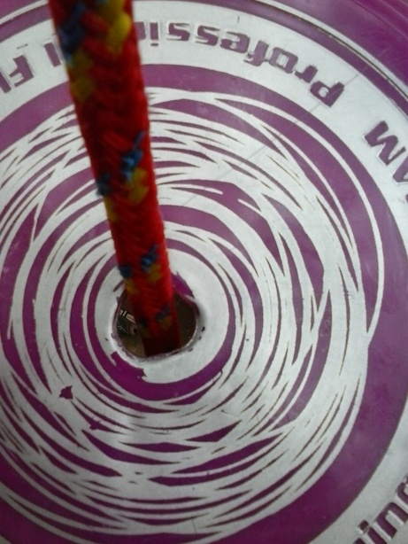

Title: Frisbee Swing
Date: June 14, 2017
Author: moondoggy

So, my kids can't get enough of this stupid swing I made with an old frisbee
and some nylon rope (and a blow torch--spoiler: FIRE!), so I thought I'd post
it.  In fact, they're currently fighting over it in the yard as I try to post
the photos below.

It holds easily a 50 lb. child jumping on it, and it's been up for at least 4
years now.  It's really rugged, and the key is the blow torch.  If you *cut* a
hole in something, you make tiny cracks that can (and usually do) grow under
stress.  If you *melt* a hole in the frisbee, two cool things happen that make
it really strong.  First, the plastic recedes from the hole to make a hard,
thick, strong rim.  Second, the rim is formed smooth and has no cracks.

Here's how to make it.  You will need:

1.  a strong plastic frisbee
1.  a small blow torch
1.  1/2 " rope
1.  several sizes of washers from 1/2 " up to 1.5"
1.  wire cutters

Instructions:

1. Put the frisbee on an outdoor fireproof surface, such as wet earth.  Think
   carefully about this.
1. Holding the tip of the flame an inch or two away from the center of the
   frisbee, carefully melt a hole slightly less than 1/2" in diameter.  Remove
   the torch *immediately*, because the hole will continue to grow slightly.
1. Let the frisbee cool for several minutes, while you hang the top of the
   rope, cut to the desired length with the cutters.
1. Put the rope through the hole in the frisbee, slide on a stack of washers
   and tie a figure-8 knot.

When you put on the washers, keep in mind that the purpose of the several sizes
is to make sure that the knot will not go through the smallest washer and the
largest washer is much larger than the hole in the frisbee.

*In no time, your kids will be fighting over it too!*

